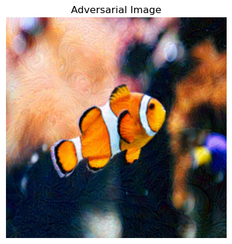
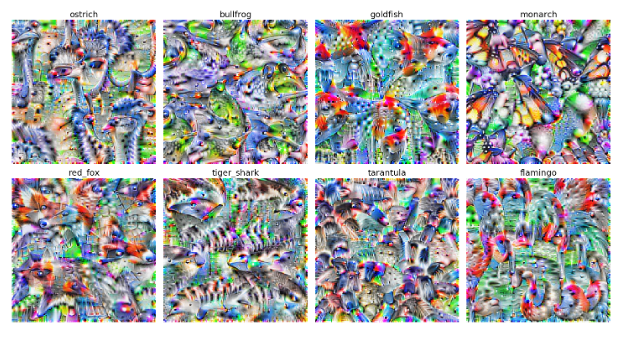
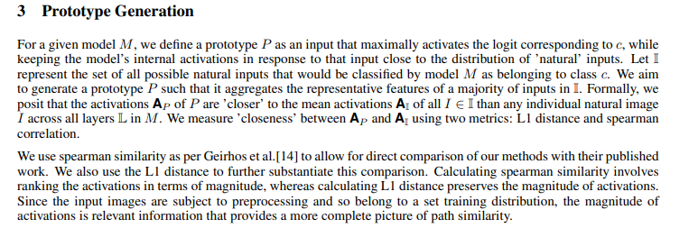
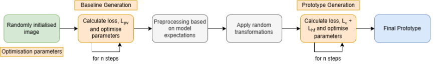

# Interpretability-in-ML
Interpretability techniques in Machine Learning including Feature Viz, Interp in LLMs, and other techniques.

## What is ML Interpretability? 
Machine Learning, while dominant in its performance, poses some threats to ethical guidelines, safety in its responses regardless of the *type* of Deep Neural Network. It could be LLMs, VLMs, Motion in Robotics, Self-Driving cars etc.  

Our goal is to be able to answer what exactly is going inside the model by using the following questions  
1. What did the model learn?
2. What features from the input make the model generate certain outputs?

Knowing these things or these questions or knowing the mechanisms well, it allows us to 
1. Debug and tune the model
2. Increase our trust in the model
3. Discover novel insights from data. 

 
This gave rise to novel architectures such as Sparse Autoencoders that are widely adopted in Deep Learning to uncover hidden realities of large neural networks. 

### Tricking the Classifier
Here I use a pre-trained ResNet18 that was pretrained using ImageNet to demonstrate how tricking a classifier can happen very easily by injecting small noise. The idea is pretty simple.  
Backpropogation is computed across all the layers in the model starting from the output *Y* to the first layer of the model. But what if we could compute gradient of the output w.r.t the input tensor.  
By cloning the input tensor (to avoid making changes to the original tensor) and enabling its gradient allows us to compute backpropogation using  `loss.backward` after computing loss between the target class and the output. Then we add noise to the gradient of the input tensor and add it to the tensor much like gradient update **EXCEPT** that we **ADD** it instead of subtracting it.  

Very important and subtle detain in gradient update is the '-' sign which indicates moving against direction of the gradient which points to the decrease in loss. Here instead of subtracting, we *add* the updated noised gradient to the input tensor. Apart from '+' sign, everything is same as the gradient update.  

We retrive the final tensor from the model after updating the tensor with noised injection after `x` number of steps such that noised input is passed to the model at each iteration to make sure it gets further away from the target class.

  

    
    
Original Image

  

  

    
    
Adversarial Image

  

Now that we have retrieved the adversarial tensor (shown above), the predicted class is 393 (Persian Cat) instead of 407 (Fish). So models look at patterns in their input that may not make sense for humans. 

### Using Leap Labs for Interpretability
Leap labs comes with an interpretability engine to evaluate how our models "think" before predicting a class.
- It shows what our model has learned and shows what our model should think like to predict a certain class. 
- It shows entanglement between classes: ie features that are shared across different classes which can help us identify where and why our model got confused. Higher entanglement is usally attained between similar objects. 
- Isolate features to help us identify what part of the input is the model referring to for a particular image. Or what features is it looking at each input for each class. Something useful for studying entanglement. 

### Feature Visualisation
It is also one of the important techniques to studying ML model's behaviours. It lets us understand what feature a particular unit in a neural network has learned. For example, what features is a convolutional layer looking at?  

For feature visulisation, we explore and use the differentiability of the model. 

#### Understanding Feature Visualisation
Since neural networks are differentiable w.r.t inputs, we can use a layer's activations as objective and optimize the input to maximize the this objective.  

We can optimize for logits as well as an objective. In all the cases we optimize an initial noisy image to maximize a particular output class.  

However it is not very simple since optimizing from random noise ends up having high-frequency features that do not look very natural.

  

    
    
<strong>Source:</strong> Tim Sainburg

  

So we use *regularization* to force the optimization to produce more naturally looking images.  

### Regularization
Since it is an optimization problem, we can set up constraints much like we do in lagrange optimization in Calculus II or in Convex Optimization. Adding such constraints to our objective make the gradient move in directions that exhibit more of a certain pattern. 

- L1 Regularization: pushes weights to 0. The model uses the least number of features. 

We optimize the objective function in such a way that it generalises well to the data it has seen. We optimize it in such a way that it penalizes high variance neighboring pixels because such a portion of an image indicates noise.  

This is called `Feature Penalization`. Pixels very close to each other should be similar so it penalizes high variance neighbouring pixels. But this could penalize the edges where pixels change drastically for example person's clothes and background.  

We use transformation robustness where we transform the input (rotate, scale) so that feature visualisation is invariant to transformations of the image.  

This is why the prototyping works really well in Leap Labs and the images look very natural. 

  

    

      
      
    

    

      <strong>Source</strong>: 
      <a href="https://arxiv.org/pdf/2309.17144" target="_blank" style="color: #0645AD; text-decoration: none;">
        Leap Labs Paper: Prototype Generation: Robust Feature Visualisation for Data Independent Interpretability
      </a>
    

  

## Interpretability for Language Models
A language model is much like a stochastic probabilistic machine. It predicts the next token by assiging logits to it and using softmax or argmax we compute the token with highest logit/probability.  

Now we could proceed exactly how we did for vision models, compute backpropogation of the output w.r.t the input and optimize the input to maximize a particular output. However, the input space is discrete unlike vision where we have pixels ranging from 0-255 values.  

Similar experiement was run Leap Labs in which they found the words most associated with the token in the prompt. For example for token *good*:  

`got Rip Hut Jesus Shooting basketball Protective Beautiful Laughing good`  

Instead of input_tokens (input_ids) we try to optimize random input embeddings to maximize a specific output. However, this still posits two problems:

1. The embeddings that are optimizing may not correspond to any embedding in the model's dictionary
2. We need to force the model to make the input converge to an embedding that is present in the model's dictionary. 

